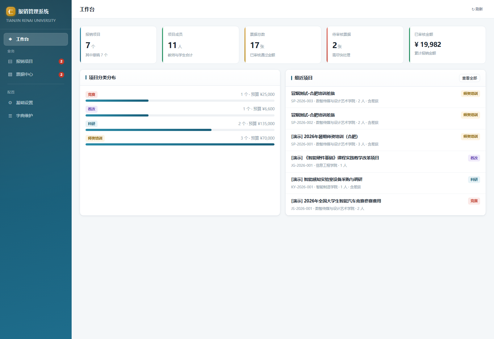
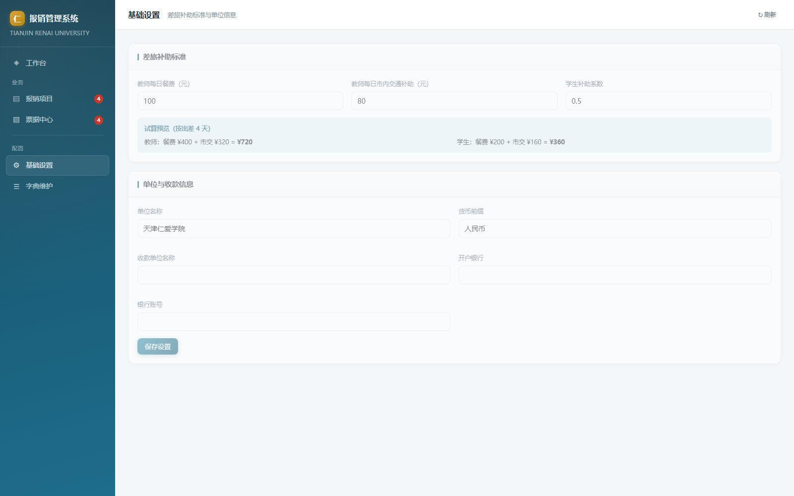
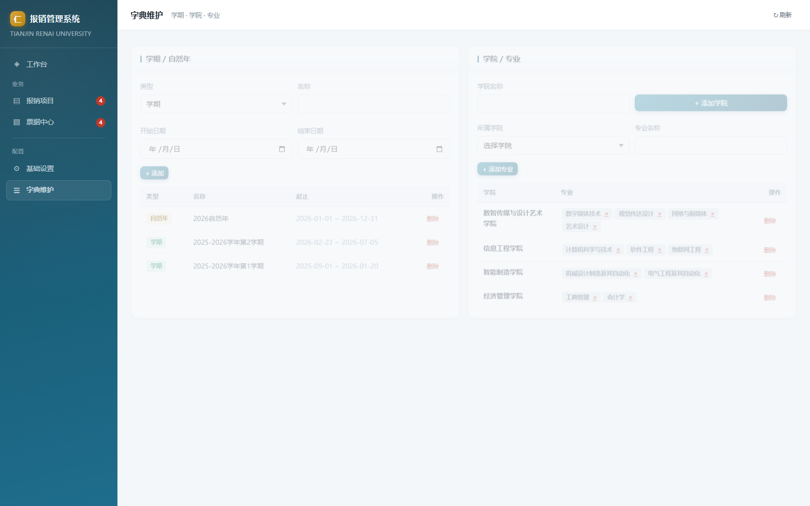
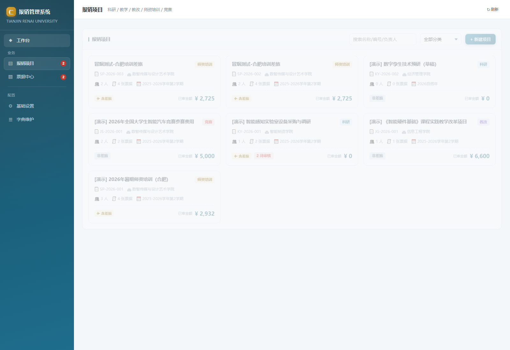
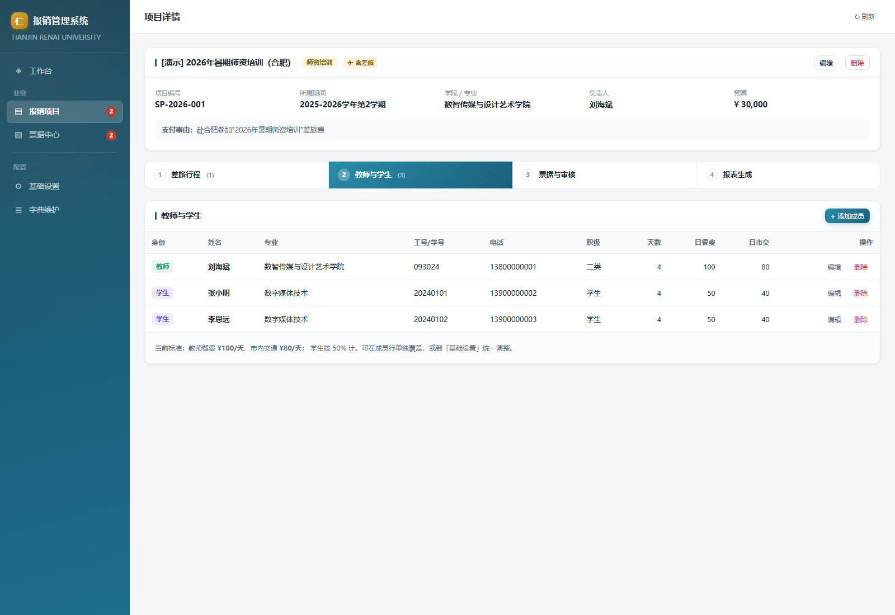
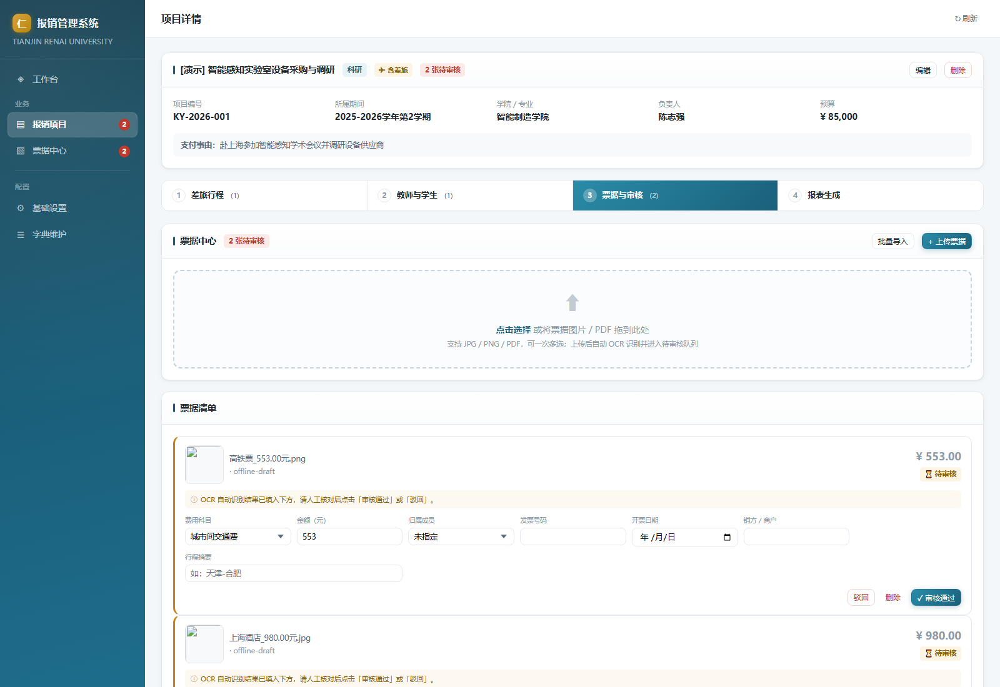
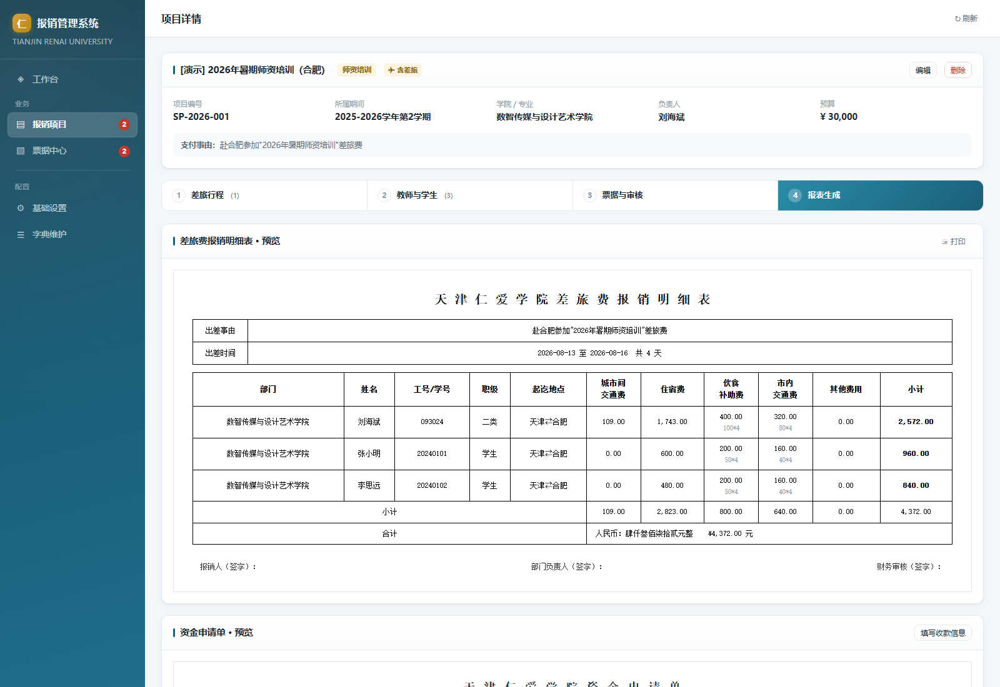
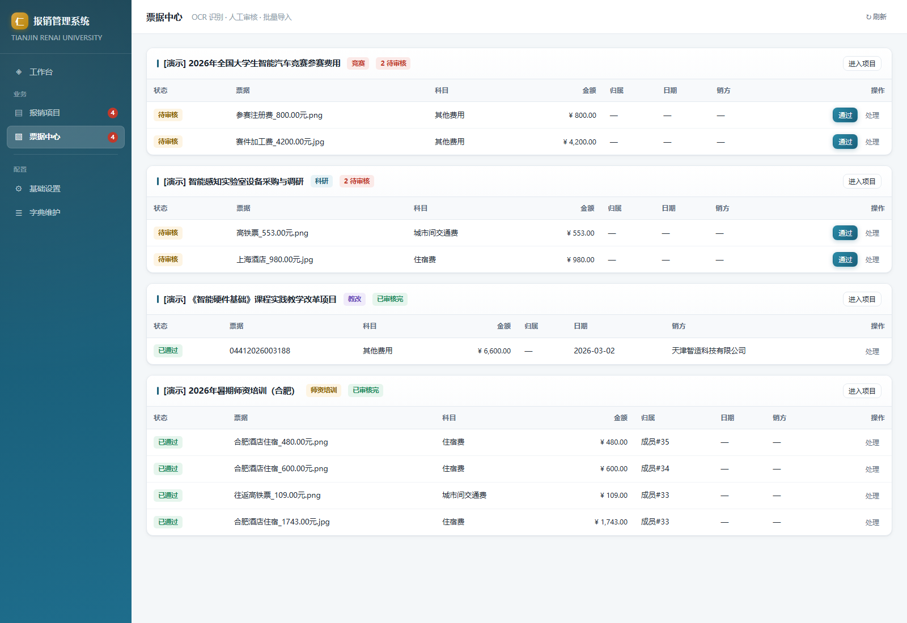

# 天津仁爱学院报销系统 · 使用说明

> 面向**报销经办人、项目负责人、财务审核人**的操作手册。
> 技术向内容（部署、目录结构、API）见项目根目录 [README.md](../README.md) 与 [deploy/DEPLOY.md](../deploy/DEPLOY.md)。

---

## 1. 启动与访问

| 方式 | 操作 | 适用 |
|---|---|---|
| 双击启动（推荐） | 双击 `启动报销系统.bat` | 非技术同事；脚本检查 Node ≥ 22 后自动开浏览器 |
| 命令行 | `npm start` | 需要看日志 |
| 重启（端口被占 / 数据库锁） | `npm restart` | 先杀掉占用 5180 的旧进程再拉起 |
| 停止 | `npm stop` | 下班关机前 |

- 访问地址：**http://127.0.0.1:5180**
- ⚠️ **不要直接双击 `server/public/index.html`**：`file://` 协议连不上后台数据库，页面会是空白（系统会弹窗提示正确入口）。
- 必须使用 **Node.js ≥ 22**（数据库用的是 Node 22 内置 `node:sqlite`）。

---

## 2. 界面总览

左侧导航共 4 个模块，右上角 `↻ 刷新` 可刷新当前页。

| 模块 | 作用 |
|---|---|
| ◈ **工作台** | 汇总卡片：项目数、待审票据、报销总额等 |
| ▤ **报销项目** | 项目列表/新建；点「进入项目」走四步向导 |
| ▧ **票据中心** | 全局待审队列，可快速「通过」或「处理」 |
| ⚙ **基础设置** | 补助标准、单位名称、默认收款信息 |
| ☰ **字典维护** | 期间（学期/自然年）、学院、专业 |



---

## 3. 首次使用：按顺序做这 6 步

| 步骤 | 在哪做 | 做什么 |
|---|---|---|
| ① | 基础设置 | 确认伙食/市内交通补助标准、单位名称、默认收款账户 |
| ② | 字典维护 | 确认学院、专业、期间齐全（已内置官网 12 学院 / 39 专业） |
| ③ | 报销项目 | 新建项目（选类别、学院、是否有差旅） |
| ④ | 项目 · 步骤 1/2 | 添加教师与学生 + 录差旅行程（行程可按人绑定） |
| ⑤ | 项目 · 步骤 3 | 上传票据（OCR）→ **逐张审核通过** |
| ⑥ | 项目 · 步骤 4 | 预览报表 → 导出 docx / xlsx |

> **顺序不能乱**：票据必须「审核通过」才会计入金额；没有成员和天数，补助算不出来。

---

## 4. 基础设置



| 字段 | 默认值 | 说明 |
|---|---|---|
| 教师日餐费 | 100 元/天 | 伙食补助费日标准 |
| 教师日市内交通 | 80 元/天 | 市内交通补助日标准 |
| 学生系数 | 0.5 | 学生按教师标准 × 系数（即餐 50、市交 40） |
| 单位名称 | 天津仁爱学院 | 写入资金申请单抬头 |
| 币种前缀 | 人民币 | 合计行大写前缀 |
| 收款单位名称 / 开户银行 / 银行账号 | 空 | 导出资金申请单时的默认值，可在导出时临时改 |

保存后**立即对所有项目生效**，页面下方有「按出差 4 天」的试算预览可核对。

---

## 5. 字典维护



- **期间**：支持「学期」「自然年」两种口径，新建项目时选归属期间。
- **学院 / 专业**：已按学校官网（`tjrac.edu.cn/jgsz/ejxy.htm`）内置 **12 个二级学院 + 39 个本科专业**；专业下拉会**按所选学院自动过滤**。
- 需要同步官网最新数据：`node --experimental-sqlite server/sync_org.js --dry-run` 先看差异，确认后去掉 `--dry-run` 执行。

---

## 6. 报销项目



新建项目字段：

| 字段 | 必填 | 说明 |
|---|---|---|
| 项目名称 | ✅ | 如「2026年暑期师资培训（合肥）」 |
| 项目编号 | — | 留空自动生成（前缀 + 序号，自动避让已有编号） |
| 项目分类 | ✅ | 科研 `SP` / 教改 `JG` / 师资培训 `PX` / 竞赛 `JS` / 其他 `QT` |
| 所属期间 | — | 学期或自然年 |
| 学院 / 专业 | — | 专业列表随学院联动 |
| 项目负责人 | — | |
| 预算金额 | — | 仅作参考，不参与报销计算 |
| 支付事由 | — | 会写入资金申请单的「支付事由」 |
| 是否含差旅 | — | 决定导出物：有差旅多一份《差旅费报销明细表》 |

列表支持**按名称搜索 + 按分类筛选**；删除项目会级联删除其行程、成员、票据。

---

## 7. 项目四步向导



### 步骤 1 · 教师与学生

| 字段 | 说明 |
|---|---|
| 身份 | 教师 / 学生（学生补助按系数减半） |
| 姓名、工号/学号、专业、电话 | 专业可从下拉选（按项目学院过滤） |
| 职级 | 如「二类」，学生可留空 |
| 出差天数 | 默认继承所绑定行程的天数，可单独改 |
| 日餐费 / 日市内交通 | **留空用全局标准**；填了则按个人标准算 |

💡 先加人再录行程：行程里要按人绑定，所以成员先录好，第 2 步才能勾选到人。

### 步骤 2 · 差旅行程

支持**多段行程**：点「+ 增加一行行程」可添加多行，每行一段行程。

| 字段 | 说明 |
|---|---|
| 出差事由 | 写入《差旅费报销明细表》表头 |
| 出发/返回日期 | 天数 = **含首尾**的天数 |
| 出发地 / 目的地 | 生成明细表时，每人按**自己绑定的行程**显示起讫地点 |
| 绑定人员 | 勾选只走这段行程的人；**不勾选 = 全部人员默认**套用此段行程（未绑定的人默认取第 1 段） |

💡 **不同人去不同地方**：比如 5 人去合肥、2 人去北京——录两段行程，分别勾选对应人员；生成明细表时每人一行的「起讫地点」自动各归各位。成员未单独填天数时，跟随所绑定行程的天数。

💡 **自动填充**：如果该项目的票据已经 OCR 出日期和行程，点「+ 增加一行行程」时会**自动预填**出发/返回日期与往返城市；编辑行程时可用「从票据填充空项」（只填空值，不覆盖已填）。

### 步骤 3 · 票据与审核



1. **上传票据**：支持 `jpg / jpeg / png / gif / bmp / webp / tif / tiff / pdf`，可一次选多张；PDF（含铁路电子客票）走内置文本解析。
   - 可填「补充提示」提高归类准确度，如 `住宿费 / 合肥`。
2. **人工审核**：识别结果一律是 **待审核**，必须逐张核对字段（费用科目、金额、归属成员、发票号、日期、销方、行程），点 **✓ 审核通过** 才计入报销。
   - 错票：**驳回**（不计入）或**删除**；误通过可「撤销通过」。
3. **批量导入**：点「批量导入」→ 下载 CSV 模板 → 粘数据，支持 CSV / JSON 两种格式。

CSV 模板表头：

```
票据类型,姓名,工号/学号,发票号,日期,金额,销方名称,纳税人识别号,行程,费用,备注
住宿费,刘海斌,093024,12345678,2026-03-02,1743,北京如家酒店,91110000123456789A,,住宿3晚,
城市间交通费,刘海斌,093024,22345678,2026-03-02,109,中国铁路,91110000123456789A,天津-北京,往返高铁票,
```

### 步骤 4 · 报表生成



- 上半部分是**与导出文件同版式的预览**，可点 🖨 **打印**（或直接浏览器打印为 PDF 留存）。
- 导出按钮：

| 按钮 | 产物 | 条件 |
|---|---|---|
| ⬇ 导出差旅费报销明细表 | `项目编号_差旅费报销明细表.docx` | 项目含差旅且有行程 |
| ⬇ 导出资金申请单 | `项目编号_资金申请单.xlsx` | 任何项目 |

- 导出资金申请单时会先弹窗填「报销金额 / 收款单位名称 / 开户银行 / 银行账号 / 支付方式」，可临时覆盖默认值。
- 导出文件同时落在服务器的 **`exports/`** 目录，历史记录可在报表步骤追溯。

---

## 8. 金额是怎么算出来的

| 费用项 | 计算规则 |
|---|---|
| 城市间交通费 | 该类票据金额之和；明细表显示表达式，如 `54.5*2`（单程票价 × 张数），多种票价用 `+` 连接 |
| 住宿费 | 住宿票据金额之和 |
| 伙食补助费 | 日标准 × 出差天数（学生 × 系数）；显示 `100*4` |
| 市内交通费 | **有市内交通票据就按票据实报**，否则按 日标准 × 天数 |
| 其他费用 | 其他类票据逐条列出（超 3 条合并为「其他 N 项」） |
| 小计 | 每人五项相加 |
| 合计 | 全员小计之和；明细表末行给出**人民币大写 + ¥ 小写** |

> 只有 **审核通过（approved）** 的票据参与计算；待审核、驳回的都不计入。

---

## 9. 导出的两份表

| 文件 | 版式 |
|---|---|
| 差旅费报销明细表 .docx | 横向 A4，11 列（部门/姓名/工号/职级/起讫地点/城市间交通费/住宿费/伙食补助费/市内交通费/其他费用·项目·金额），列头纵向合并，含小计行与整行合并的**合计行**，底部签字区 |
| 资金申请单 .xlsx | 复刻学校官方模板：标题行、日期行（留空手写）、合同编号+收款单位、开户行+账号、金额数字网格（前导零 ⊗ 注销）+ ¥ 小写、两行 6 格签字栏。**「合同(项目)编号及名称」仅科研类项目填写**，教学 / 教改 / 师资培训 / 竞赛一律留空 |

---

## 10. 票据中心（全局）

左侧「票据中心」汇总**所有项目**的待审票据，徽标数字 = 待审数量。
列表里可直接点 **通过** 快速放行，或点 **处理** 跳到对应项目的票据步骤逐张核对。

### 按项目合并打印票据

每个项目卡片（以及项目详情 · 票据步骤）右上角都有 **🖨 打印全部票据**：
系统会把该项目**所有 PDF 票据按上传顺序合并成一个 PDF**（每张票据单独一页），弹窗内先预览，确认后点 **🖨 打印** 调起打印对话框；也可以点 **新窗口打开** 用浏览器自带的 PDF 打印。
非 PDF 票据（图片等）会自动跳过，不参与合并。



---

## 11. 常见问题

| 现象 | 原因 / 处理 |
|---|---|
| 打开页面一片空白 | 用 `file://` 打开了 HTML → 必须访问 http://127.0.0.1:5180 |
| `npm start` 报端口占用 / 数据库锁 | 执行 `npm restart`（先杀旧进程） |
| 提示需要 Node 版本 | 升级到 Node ≥ 22 |
| 票据识别字段为空或不准 | 识别结果本来就需**人工审核**：在票据卡片上直接改字段，改完点「审核通过」 |
| 补助金额算不出来 | 检查：成员是否添加、出差天数是否填、行程是否存在 |
| 想给同事访问 | 设置环境变量 `AUTH_USER` / `AUTH_PASS` 启用 Basic Auth，或按 `deploy/DEPLOY.md` 部署到服务器 |
| 想看演示效果 | `node --experimental-sqlite server/demo_data.js`（生成 5 个覆盖全分类的演示项目） |
| 数据丢了怎么办 | 数据库在 `data/reimburse.db`，定期用 `deploy/backup.sh` 备份 |
| 导出报错 | 看 `data/server.log`；80% 是服务未启动或项目缺行程/成员 |

---

## 12. 运维速查

```bash
npm start                 # 启动
npm restart               # 强制重启（杀 5180 占用进程）
npm stop                  # 停止
node --experimental-sqlite server/smoke.js        # API 冒烟（56 项）
node --experimental-sqlite server/ui_smoke.js     # 界面冒烟（无头浏览器）
python server/verify_exports.py                   # 导出文件校验（40 项）
node --experimental-sqlite server/demo_data.js    # 灌演示数据
node --experimental-sqlite server/sync_org.js --dry-run   # 同步学院/专业（预演）
```

日志文件：`data/server.log`　·　数据库：`data/reimburse.db`　·　票据原件：`data/uploads/`　·　导出件：`exports/`
